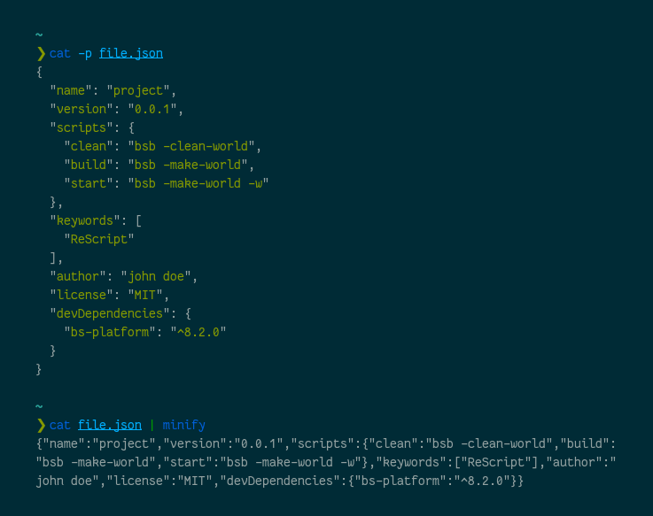

# JSON Minifier

Tool to parse and minify JSON.



## Building and running

Make sure you have [stack](https://haskellstack.org/) installed and run the
following:

```sh
$ stack build

$ cat file.json | stack exec minify
{"foo":true,"bar":123,"baz":"abc","quux":[1,"a",false]}
```

**Warning**: Don't use that tool in your production environment, it doesn't
supports all the JSON standards (like floating point numbers and escape
characters). Use this code to learn more about Haskell and parsing process.
